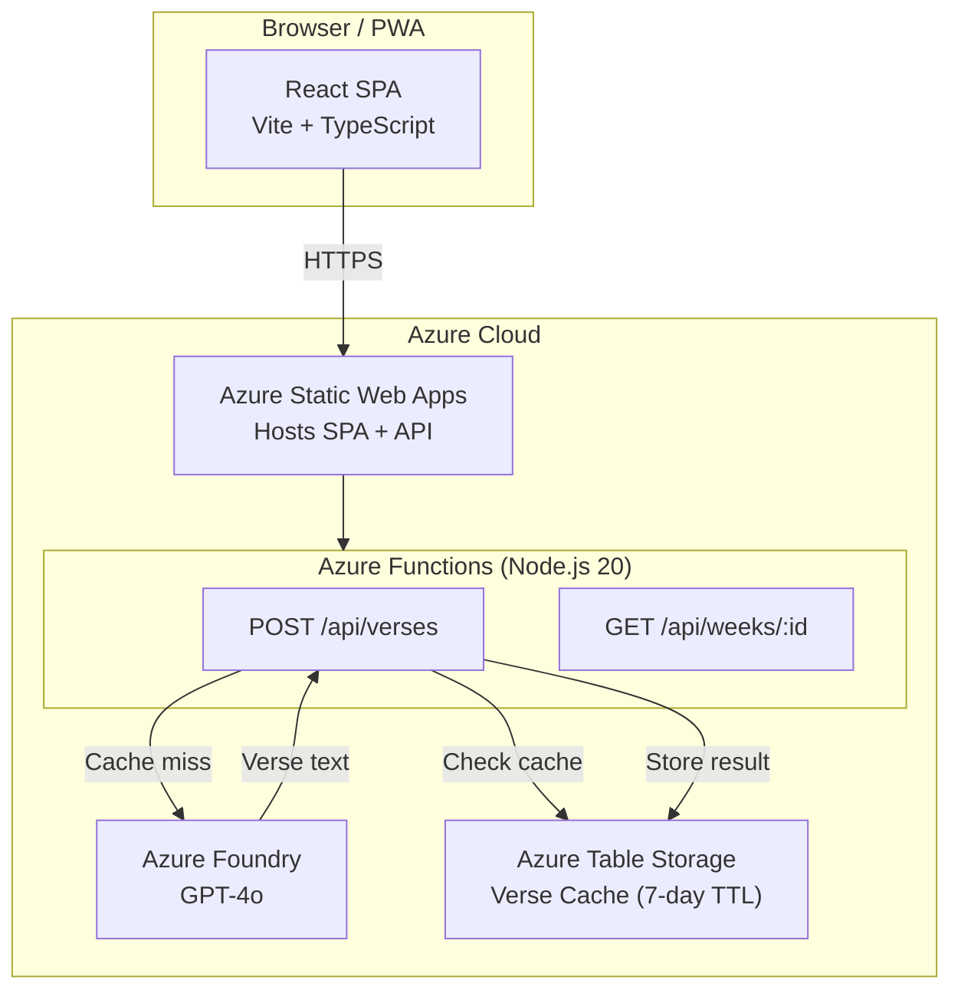

# MFers Bible Study App

[](https://github.com/kjingers/MFers-Study/actions/workflows/azure-static-web-apps.yml)
[](LICENSE)

A mobile-first Progressive Web App (PWA) for small group Bible study. Opens instantly to the current week's content—no login, no friction.

**🌐 Live Demo:** [https://lively-sand-015fd1b0f.4.azurestaticapps.net](https://lively-sand-015fd1b0f.4.azurestaticapps.net)

---

## 📋 Table of Contents

- [Features](#-features)
- [Architecture](#-architecture)
- [Tech Stack](#-tech-stack)
- [Project Structure](#-project-structure)
- [Getting Started](#-getting-started)
- [Azure Resources](#-azure-resources)
- [Contributing](#-contributing)
- [License](#-license)

---

## ✨ Features

| Feature | Description |
|---------|-------------|
| **Week Navigation** | Browse weekly Bible study content with prev/next controls |
| **Bible Verse Modal** | Click any verse reference to view full scripture text |
| **4 Translations** | NIV, ESV, KJV, and MSG translation tabs |
| **AI-Powered Verses** | GPT-4o retrieves accurate verse text via Azure OpenAI |
| **Server-Side Caching** | 7-day cache reduces API costs and improves latency |
| **PWA Support** | Install to homescreen on mobile devices |
| **Mobile-First Design** | Dark theme with 44px touch targets |
| **Question Highlighting** | Tap to highlight the current discussion question |
| **Live Question Sync** | Real-time sync via Azure SignalR across all devices |
| **Dinner Tracker** | See who's bringing dinner each week |
| **Meal Signup** | Claim/release dinner hosting slots with family selection |
| **RSVP Attendance** | Track who's coming each week |
| **Swipe Navigation** | Horizontal swipe gestures for mobile week navigation |
| **Bottom Tab Navigation** | Study/Schedule tabs for quick access |
| **Accessibility** | WCAG 2.1 AA compliant with ARIA labels |

---

## 🏗 Architecture



### Data Flow

1. **User clicks verse reference** → React triggers API call
2. **Azure Functions checks cache** → Returns cached verse if available
3. **Cache miss** → Calls Azure Foundry (GPT-4o) for verse text
4. **Response cached** → Stored in Table Storage for 7 days
5. **Verse displayed** → Modal shows verse with translation tabs

---

## 🛠 Tech Stack

| Layer | Technology |
|-------|------------|
| **Frontend** | React 19 + TypeScript 5 + Vite 7 |
| **Styling** | Tailwind CSS 4 + shadcn/ui |
| **State** | Zustand (client) + TanStack Query (server) |
| **Routing** | React Router 7 |
| **Backend** | Azure Functions v4 (Node.js 20) |
| **AI** | Azure Foundry / OpenAI (GPT-4o) |
| **Database** | Azure Table Storage |
| **Hosting** | Azure Static Web Apps |
| **Testing** | Vitest + React Testing Library + Playwright |
| **CI/CD** | GitHub Actions |

---

## 📁 Project Structure

```
mfers-app/
├── api/                          # Azure Functions backend
│   ├── src/
│   │   ├── functions/
│   │   │   ├── verses.ts         # POST /api/verses - verse lookup
│   │   │   └── weeks.ts          # GET /api/weeks/:id - week content
│   │   └── shared/
│   │       ├── azure-foundry.ts  # Azure OpenAI client
│   │       ├── table-storage.ts  # Cache operations
│   │       ├── verse-cache.ts    # Cache logic
│   │       └── types.ts          # Shared TypeScript types
│   ├── host.json
│   ├── package.json
│   └── tsconfig.json
│
├── src/
│   ├── components/
│   │   ├── dinner/               # Dinner card components
│   │   ├── questions/            # Discussion question list
│   │   ├── reading/              # Reading content & verse links
│   │   ├── ui/                   # shadcn/ui components
│   │   ├── verse-modal/          # Verse display modal
│   │   └── week/                 # Week navigation & viewer
│   ├── hooks/                    # Custom React hooks
│   │   ├── useVerseQuery.ts      # Verse data fetching
│   │   └── useWeekQuery.ts       # Week data fetching
│   ├── lib/
│   │   ├── utils.ts              # Utility functions (cn, etc.)
│   │   └── verse-parser.ts       # Bible reference parser
│   ├── services/
│   │   ├── api.ts                # API client
│   │   └── verse-service.ts      # Verse service layer
│   ├── store/
│   │   ├── highlights.ts         # Question highlight state
│   │   └── index.ts              # Store exports
│   └── types/                    # TypeScript definitions
│       ├── verse.ts
│       └── week.ts
│
├── public/
│   ├── icons/                    # PWA icons
│   ├── manifest.json             # PWA manifest
│   └── staticwebapp.config.json  # Azure SWA config
│
├── e2e/                          # Playwright E2E tests
├── package.json
├── tailwind.config.js
├── vite.config.ts
└── tsconfig.json
```

---

## 🚀 Getting Started

### Prerequisites

- Node.js 20+
- npm 10+
- Azure Functions Core Tools (for API development)

### Installation

```bash
# Clone the repository
git clone https://github.com/kjingers/MFers-Study.git
cd MFers-Study/mfers-app

# Install frontend dependencies
npm install

# Install API dependencies
cd api && npm install && cd ..
```

### Local Development

```bash
# Start frontend dev server (http://localhost:5173)
npm run dev

# In a separate terminal, start API (http://localhost:7071)
cd api && npm start
```

### Running Tests

```bash
# Frontend tests
npm test                    # Unit tests
npm run test:e2e           # Playwright E2E tests

# API tests
cd api && npm test
```

### Build & Deploy

```bash
# Frontend
npm run build              # Production build → dist/

# API
cd api && npm run build    # Compile TypeScript → dist/
```

---

## ☁️ Azure Resources

| Resource | Purpose | Configuration |
|----------|---------|---------------|
| **Azure Static Web Apps** | Hosts React SPA + Functions API | Standard tier, GitHub Actions deployment |
| **Azure Functions** | Serverless API (Node.js 20) | Consumption plan, integrated with SWA |
| **Azure Foundry (OpenAI)** | GPT-4o for verse retrieval | Pay-per-use, cached responses |
| **Azure Table Storage** | Verse cache (7-day TTL) | Part of Storage Account |

### Environment Variables

The API requires these environment variables for Azure Foundry:

```env
AZURE_OPENAI_ENDPOINT=https://your-resource.openai.azure.com
AZURE_OPENAI_API_KEY=your-api-key
AZURE_OPENAI_DEPLOYMENT=gpt-4o
```

---

## 🤝 Contributing

We welcome contributions! Please read our [Contributing Guide](mfers-app/CONTRIBUTING.md) for details on:

- Code of conduct
- Development setup
- Code style guidelines
- Submitting pull requests

### Quick Start for Contributors

```bash
# Fork and clone
git clone https://github.com/your-username/MFers-Study.git
cd MFers-Study/mfers-app

# Create feature branch
git checkout -b feature/your-feature

# Make changes, then run checks
npm run lint && npm run typecheck && npm run build

# Commit and push
git commit -m "feat: your feature"
git push origin feature/your-feature
```

---

## 📄 License

This project is licensed under the MIT License - see the [LICENSE](mfers-app/LICENSE) file for details.

---

<p align="center">
  <sub>Built with ❤️ for Bible study fellowship</sub>
</p>
